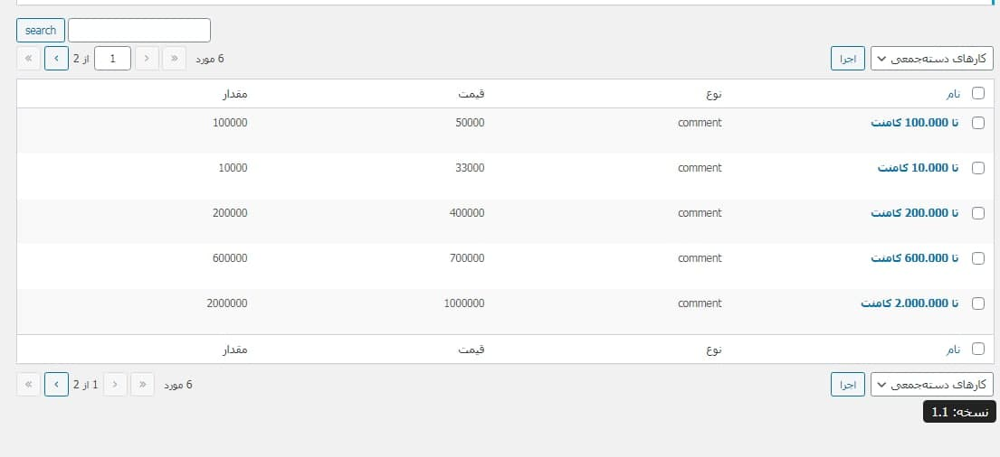

## توضیحات در مورد پلاگین وردپرس برهان مدیا

کاربران سایت با استفاده از این پلاگین میتوانند اطلاعات کاربران دیگر را از سایت اینستاگرام در آورده مانند
 
لیست فالوور ها، لیست کامنت ها و... با پرداخت هزینه ساخته شده بصورت داینامیک در پنل تنظیمات

### قابلیت ها
  - لیست اسپانسر ها - برای برسی فالوو شدن اکانت های اسپانسر ها توسط کاربران و دریافت کد قرعکشی در صورت فالو کردن کامل اسپانسر ها
  - فورم دریافت لیست فالوور، لایک، کامنت و.. اکانت های اینستاگرام بصورت خودکار
  - جدول لیست قیمت داینامیک با شرط های خاص
  - کد های کوتاه لیست اسپانسر ها
  - دانلود و استخراج فالوور های اسپانسر ها

### نحوه استفاده
ریپازیتوری را کلون کرده و در پوشه `wp-plugins/plugins` ریخته
 
یا از داخل پنل وردپرس فایل zip ریپازیتوری را افزودن کنید

## تصاویر از افزونه
در این قسمت تعدادی تصویر از قسمت های افزونه قرار داده شده است

### فورم قرعه کشی

### فرم قرعه کشی موفق

### کد کوتاه لیست اسپانسر ها

### جدول اسپانسر ها در داشبورد

### عملیات استخراج در حال انجام

### عملیات استخراج موفق

### جدول لیست قیمت داینامیک

